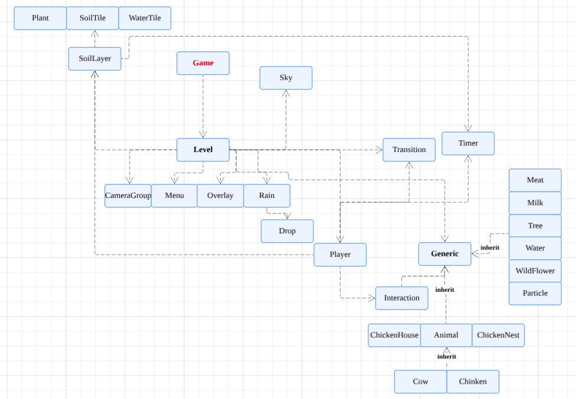

# AOOP Final Project


NYCU Valley is a single player farming games. You can plant as many crops as you like and enjoy the cute animals accompany in your NYCU Valley. Try to build a wonderful farm and sell your product.

## 架構
- 以NYCU VALLEY為主體 並將plane_game作為子遊戲附在裡面
- 
## Class Diagram
### Plane Game
🛠️


[See more details here](https://lucid.app/lucidchart/92c029b0-b6c8-464c-aa2a-790c3bee1c45/edit?viewport_loc=-1664%2C-1778%2C3074%2C1660%2C0_0&invitationId=inv_135f1ff5-3c28-4422-b8c8-b278b6b06117)
### NYCU VALLEY

## Report Link
[ppt](https://www.canva.com/design/DAGbKZRHVXk/pSW3tnpWlCMot5XB4sFIYg/edit?utm_content=DAGbKZRHVXk&utm_campaign=designshare&utm_medium=link2&utm_source=sharebutton)

## How to run the game?
1.Clone the repository
```
bash
git clone git@github.com:TTT426/aoop_final_project.git
cd 'NYCU VALLEY'/code
```

2. Install dependencies:
```
bash
pip install -r requirements.txt
```
## Control
# NYCU Valley:

move : arrow key
open player backback : press 'm'
switch item: arrow key

switch tool : press 'q'
switch seed : press 'e'

use tool : press 'space'
use seed : press 'left ctrl'


