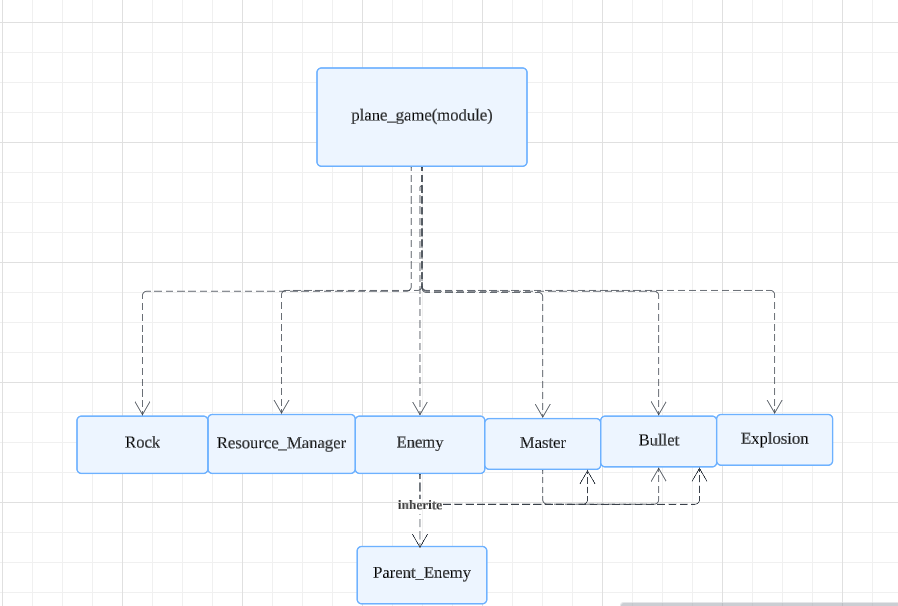

# AOOP Final Project
## milk bug can't pick already fixed (because of class defination)


NYCU Valley is a single player farming games. You can plant as many crops as you like and enjoy the cute animals accompany in your NYCU Valley. Try to build a wonderful farm and sell your product.

Included mini games:


The points earned from this plane game can be converted into NYCU VALLEY coins. However, if the player's health reaches zero, the rewards will be halved. It is a high-risk, high-reward game.
## 架構
- 以NYCU VALLEY為主體 並將plane_game作為子遊戲附在裡面
## Class Diagram
### NYCU VALLEY

### Plane Game


See more details:
[NYCU VALLEY](https://reurl.cc/RLQOlx)
[Plane game](https://reurl.cc/G5lX2A)

### NYCU VALLEY

## Report Link
[ppt](https://www.canva.com/design/DAGbKZRHVXk/pSW3tnpWlCMot5XB4sFIYg/edit?utm_content=DAGbKZRHVXk&utm_campaign=designshare&utm_medium=link2&utm_source=sharebutton)

## How to run the game?
1.Clone the repository and Install dependencies:
```
bash
git clone git@github.com:TTT426/aoop_final_project.git
cd aoop_final_project
pip install -r requirements.txt
```

2. run the game
```
bash
cd 'NYCU VALLEY'/code
python3 main.py
```
## Control
### NYCU Valley:

- move : arrow key
- open player backback : press 'm'
- switch item : arrow key
- chosse item : press 'space'

- switch tool : press 'q'
- switch seed : press 'e'

- use tool : press 'space'
- use seed : press 'left ctrl'
- go to bed : press 'enter'

### Plane :

- move : arrow key
- fire bullets : press 'space'
- leave the game : press 'ESC'
- pause the game : press 'P'
  
## What you can do?
- plant the crops
- collect animal products
- trade
- play Plane


